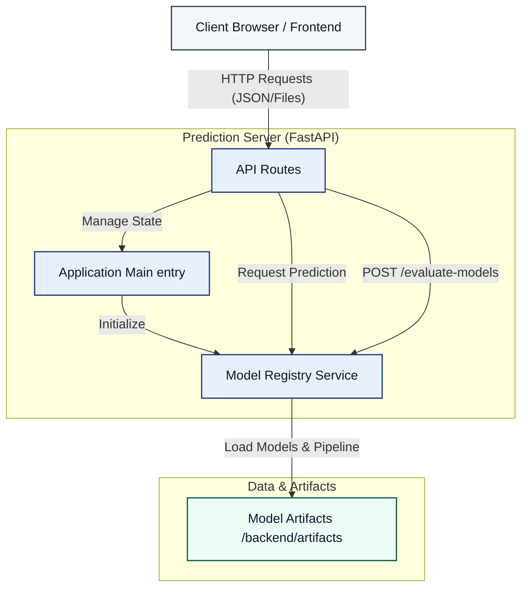

# Intermediate Evaluation Deliverables

## 1. Architecture Diagram

The system follows a Client-Server architecture with a clear separation between the data science artifacts and the application logic.



### Module Descriptions
- **Client**: The frontend interface (Static HTML/JS) that interacts with the user.
- **Server**: The Python FastAPI backend handles business logic.
    - **`main.py`**: Initializes the application, configuring middleware (CORS) and mounting the static frontend. It bootstraps the Model Registry on startup.
    - **`routes/`**: Defines the accessible API endpoints:
        - `predict.py`: Real-time single prediction.
        - `evaluate.py`: Batch evaluation of models using uploaded datasets.
        - `models.py`: Information about available models.
    - **`services/registry.py`**: A dedicated service that manages the lifecycle of machine learning models. It reads the `manifest.json`, loads the serialized model files (`.joblib`), and exposes them to the routes.

## 2. Prediction Objects

The system uses defined schemas for input requests and output responses to ensure reliability.

### Input Object (Prediction Request)
Structure of the JSON payload sent to `POST /api/predict-single`.

**Schema Description:**
- `model_id` (Optional): The ID of the specific model to use (e.g., "logreg"). Defaults to the system default if omitted.
- `features`: A key-value dictionary containing the input features required by the model.

**Example Format:**
```json
{
  "model_id": "naive_bayes",
  "features": {
    "Airline": "Delta",
    "Origin": "JFK",
    "Dest": "LHR",
    "DepDelay": 15,
    "Distance": 3450
  }
}
```

### Output Object (Prediction Result)
Structure of the JSON response returned by the server.

**Schema Description:**
- `model_id`: The ID of the model that performed the prediction.
- `prediction`: The classification result (e.g., "1" for Cancelled, "0" for Not Cancelled).

**Example Format:**
```json
{
  "model_id": "naive_bayes",
  "prediction": "1"
}
```

### Model Artifact Object (Manifest)
The `manifest.json` file serves as the configuration source of truth, describing the available models and data schema.

**File Format:**
```json
{
  "target_column": "Cancelled",
  "feature_columns": ["Airline", "Origin", "Dest", "DepDelay", "Distance"],
  "default_model": "naive_bayes",
  "pipeline": {
    "path": "pipeline.joblib",
    "description_path": "pipeline_description.json"
  },
  "models": [
    {
      "id": "logreg",
      "technique": "Logistic Regression (SGD)",
      "path": "logreg.joblib",
      "hyperparams_path": "logreg_hyperparams.json"
    }
  ]
}
```
